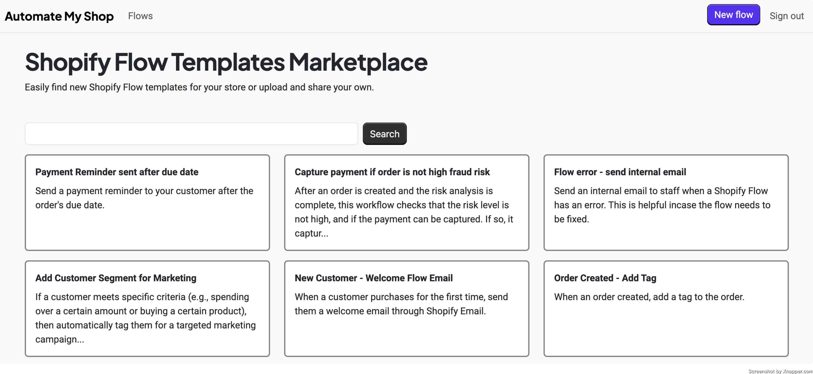

# Automate My Shop

A marketplace for merchants and Shopify Partners to share Shopify Flow templates with the community.

[View production app](https://automatemyshop.com/)

## Features

- Upload and download Shopify Flow templates
- Real time search
- User authentication and access control
- Mobile responsiveness

## How it Works

Core stack: Ruby on Rails, Turbo, Bootstrap, Postgres, Amazon S3, Mailersend

Anyone can visit the site and browse from the list of Shopify Flow templates. If they find one they like they can download the file then upload it to Shopify Flow in their store admin.

If someone wants to upload their own file to share they can sign up for account. If the email isn't in the database it will log them in automatically. The next time they visit the site and want to log in they will be sent a magic link to click, which will authenticate them.
